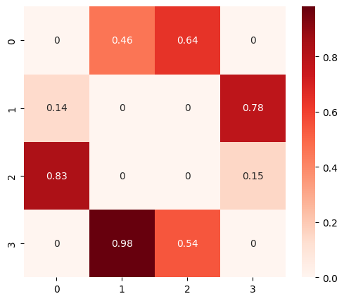
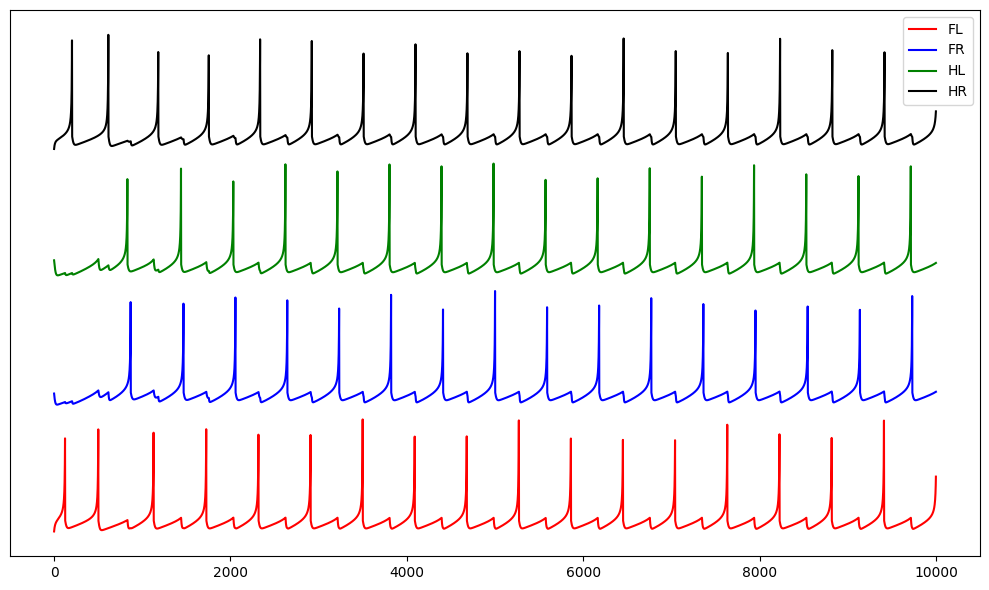

# Spiking Neural Network CPG with STDP Learning

### Project Description
A simulation of a Quadruped Central Pattern Generator (CPG) that **learns** a Trot gait using **Anti-Hebbian Spike-Timing Dependent Plasticity (STDP)**.

The network dynamics are modeled using **Izhikevich neurons (2003)** to capture realistic spiking behavior. The system solves the differential equations using **Euler's Method** with a time step of **dt = 0.1 ms** to ensure numerical stability during rapid voltage spikes.

It demonstrates **Emergent Behavior**. The network is initialized with random weights and self-organizes into a stable "Trot" rhythm solely through interaction with a teacher signal and plasticity rules.

### Key Technical Insight: The "Euler Explosion"
A major challenge arose during the implementation due to the selection of the time step (`dt`). Initially using **0.5 ms** resulted in an explosion where the voltage spiked to infinity (values reached `1e159`). This occurred because the quadratic term ($v^2$) in the Izhikevich differential equation causes the voltage slope to steepen rapidly during a spike; a larger time step fails to capture this curve, leading to numerical instability. Reducing `dt` to **0.1 ms** resolved this.

### Visuals
**1. Learned Synaptic Weights**

*The heatmap above shows the learned inhibitory connections. Strong inhibition (Dark Red) formed between competing limbs (e.g., FL vs FR), while diagonal pairs remained uncoupled, creating the Trot architecture.*

**2. Learned Trot Gait (Test Run)**

*Voltage traces during the test phase (No external teacher). The network autonomously generates an alternating rhythm where diagonal pairs (FL/HR and FR/HL) fire in sync.*

### Dependencies
To run the simulation, you need Python 3 and the following libraries:
* `numpy`
* `matplotlib`
* `seaborn`

### How to Run
1. **Clone the repository:**
   ```bash
   git clone [https://github.com/samarkodwani/trot-simulation-stdp.git](https://github.com/samarkodwani/trot-simulation-stdp.git)

2. **Run the Learning Simulation**: This script initializes a random brain, trains it with a teacher signal, and tests the learned behavior.
python main_learning.py

3. **Run the Static Baseline (Control)**: This script runs a hardcoded CPG to demonstrate the target behavior without learning.
python baseline_static.py